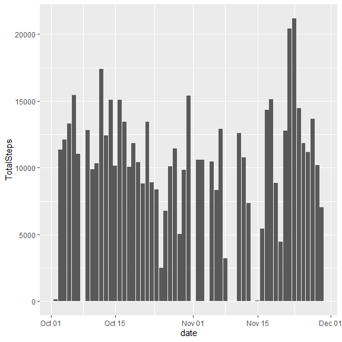
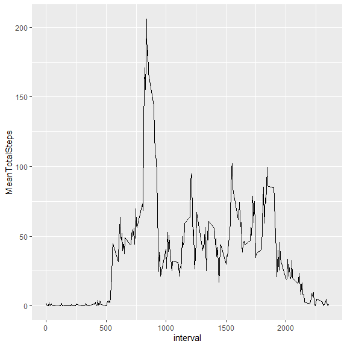
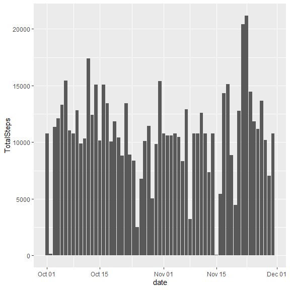
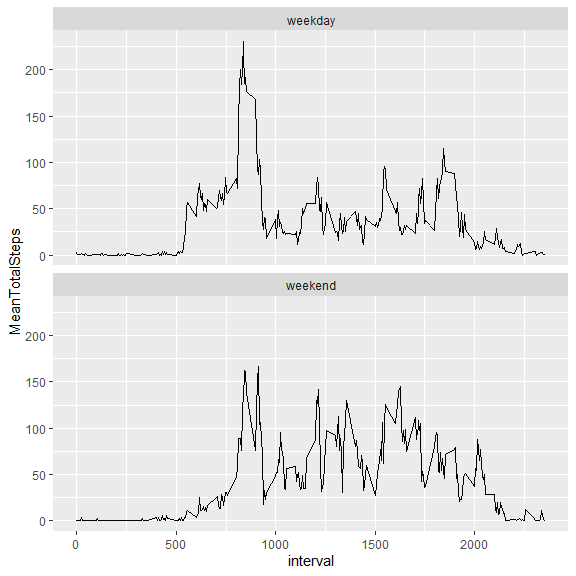

``` r
library(tidyverse)
```

```
── Attaching core tidyverse packages ──────────────────────── tidyverse 2.0.0 ──
✔ dplyr     1.1.4     ✔ readr     2.1.5
✔ forcats   1.0.0     ✔ stringr   1.5.1
✔ ggplot2   3.5.1     ✔ tibble    3.2.1
✔ lubridate 1.9.4     ✔ tidyr     1.3.1
✔ purrr     1.0.2     
── Conflicts ────────────────────────────────────────── tidyverse_conflicts() ──
✖ dplyr::filter() masks stats::filter()
✖ dplyr::lag()    masks stats::lag()
ℹ Use the conflicted package (<http://conflicted.r-lib.org/>) to force all conflicts to become errors
```

``` r
Sys.setlocale("LC_TIME", "en_US.UTF-8")
```

```
[1] "en_US.UTF-8"
```


## Loading and preprocessing the data


``` r
# Extract data and put in data directory

unzip("activity.zip", exdir = "data")

# Import data

data <- read_csv(file.path("data","activity.csv"))
```

```
Rows: 17568 Columns: 3
── Column specification ────────────────────────────────────────────────────────
Delimiter: ","
dbl  (2): steps, interval
date (1): date

ℹ Use `spec()` to retrieve the full column specification for this data.
ℹ Specify the column types or set `show_col_types = FALSE` to quiet this message.
```

``` r
# No data cleaning need for now
```


## What is mean total number of steps taken per day?

Calculate the total number of steps taken per day


``` r
total_steps_data <- data |> 
        group_by(date) |> 
        summarize(TotalSteps = sum(steps))

total_steps_data
```

```
# A tibble: 61 × 2
   date       TotalSteps
   <date>          <dbl>
 1 2012-10-01         NA
 2 2012-10-02        126
 3 2012-10-03      11352
 4 2012-10-04      12116
 5 2012-10-05      13294
 6 2012-10-06      15420
 7 2012-10-07      11015
 8 2012-10-08         NA
 9 2012-10-09      12811
10 2012-10-10       9900
# ℹ 51 more rows
```

Make a histogram of the total number of steps taken each day


``` r
total_steps_plot <- total_steps_data |> 
        ggplot(aes(x = date, y = TotalSteps))+
        geom_bar(stat = "identity")

total_steps_plot
```

```
Warning: Removed 8 rows containing missing values or values outside the scale range
(`geom_bar()`).
```

<!-- -->

``` r
ggsave(file.path("figure","total_steps_plot.png"), total_steps_plot)
```

```
Saving 6 x 6 in image
```

```
Warning: Removed 8 rows containing missing values or values outside the scale range
(`geom_bar()`).
```

Calculate and report the mean and median of the total number of steps taken per day


``` r
mean_steps_data <- data |> 
        group_by(date) |> 
        summarize(MeanTotalSteps = mean(steps, na.rm = T),
                  MedianTotalSteps = quantile(steps, probs = 0.5, na.rm = T))

mean_steps_data
```

```
# A tibble: 61 × 3
   date       MeanTotalSteps MedianTotalSteps
   <date>              <dbl>            <dbl>
 1 2012-10-01        NaN                   NA
 2 2012-10-02          0.438                0
 3 2012-10-03         39.4                  0
 4 2012-10-04         42.1                  0
 5 2012-10-05         46.2                  0
 6 2012-10-06         53.5                  0
 7 2012-10-07         38.2                  0
 8 2012-10-08        NaN                   NA
 9 2012-10-09         44.5                  0
10 2012-10-10         34.4                  0
# ℹ 51 more rows
```


## What is the average daily activity pattern?

Make a time series plot (i.e. type = "l") of the 5-minute interval (x-axis) and the average number of steps taken, averaged across all days (y-axis)


``` r
# Calculate the average number of steps for each 5-minute interval

mean_steps_by_interval_data <- data |> 
        group_by(interval) |> 
        summarize(MeanTotalSteps = mean(steps, na.rm = T))

# Create the time series plot

mean_steps_by_interval_plot <- mean_steps_by_interval_data |> 
        ggplot(aes(x = interval, y = MeanTotalSteps)) +
        geom_line()

mean_steps_by_interval_plot
```

<!-- -->

``` r
ggsave(file.path("figure","mean_steps_by_interval_plot.png"), 
       mean_steps_by_interval_plot)
```

```
Saving 6 x 6 in image
```

Which 5-minute interval, on average across all the days in the dataset, contains the maximum number of steps?


``` r
max_steps_by_interval_data <- data |> 
        group_by(interval) |> 
        summarize(MeanTotalSteps = mean(steps, na.rm = T)) |> 
        slice_max(MeanTotalSteps, n = 1)

max_steps_by_interval_data
```

```
# A tibble: 1 × 2
  interval MeanTotalSteps
     <dbl>          <dbl>
1      835           206.
```


## Imputing missing values

Calculate and report the total number of missing values in the dataset (i.e. the total number of rows with NAs)


``` r
sapply(data, function(x) sum(is.na(x)))
```

```
   steps     date interval 
    2304        0        0 
```
Devise a strategy for filling in all of the missing values in the dataset. The strategy does not need to be sophisticated. For example, you could use the mean/median for that day, or the mean for that 5-minute interval, etc.

Create a new dataset that is equal to the original dataset but with the missing data filled in.


``` r
data2 <- data

for (i in unique(data2$interval)) {
   data2[is.na(data2$steps) & data2$interval == i,"steps"] <- mean(data2$steps[data2$interval == i], 
                                                               na.rm = T)
     
}

data2
```

```
# A tibble: 17,568 × 3
    steps date       interval
    <dbl> <date>        <dbl>
 1 1.72   2012-10-01        0
 2 0.340  2012-10-01        5
 3 0.132  2012-10-01       10
 4 0.151  2012-10-01       15
 5 0.0755 2012-10-01       20
 6 2.09   2012-10-01       25
 7 0.528  2012-10-01       30
 8 0.868  2012-10-01       35
 9 0      2012-10-01       40
10 1.47   2012-10-01       45
# ℹ 17,558 more rows
```

Make a histogram of the total number of steps taken each day and ...


``` r
imputed_total_steps_data <- data2 |> 
        group_by(date) |> 
        summarize(TotalSteps = sum(steps))

imputed_total_steps_plot <- imputed_total_steps_data |> 
        ggplot(aes(x = date, y = TotalSteps))+
        geom_bar(stat = "identity")

imputed_total_steps_plot
```

<!-- -->

``` r
ggsave(file.path("figure","imputed_total_steps_plot.png"), 
       imputed_total_steps_plot)
```

```
Saving 6 x 6 in image
```

Calculate and report the mean and median total number of steps taken per day. Do these values differ from the estimates from the first part of the assignment? What is the impact of imputing missing data on the estimates of the total daily number of steps?


``` r
imputed_mean_steps_data <- data2 |> 
        group_by(date) |> 
        summarize(MeanTotalSteps = mean(steps, na.rm = T),
                  MedianTotalSteps = quantile(steps, probs = 0.5, na.rm = T))

imputed_mean_steps_data
```

```
# A tibble: 61 × 3
   date       MeanTotalSteps MedianTotalSteps
   <date>              <dbl>            <dbl>
 1 2012-10-01         37.4               34.1
 2 2012-10-02          0.438              0  
 3 2012-10-03         39.4                0  
 4 2012-10-04         42.1                0  
 5 2012-10-05         46.2                0  
 6 2012-10-06         53.5                0  
 7 2012-10-07         38.2                0  
 8 2012-10-08         37.4               34.1
 9 2012-10-09         44.5                0  
10 2012-10-10         34.4                0  
# ℹ 51 more rows
```

## Are there differences in activity patterns between weekdays and weekends?

Create a new factor variable in the dataset with two levels – “weekday” and “weekend” indicating whether a given date is a weekday or weekend day.


``` r
weekday_values <- weekdays(as.Date("2025-01-01") + 0:6)[c(-4,-5)]
weekend_values <- weekdays(as.Date("2025-01-01") + 0:6)[c(4,5)]

data3 <- data2 |> 
        mutate(weekday_name = weekdays(date),
               type_weekday = factor(case_when(
                       weekday_name %in% weekday_values ~ "weekday",
                       weekday_name %in% weekend_values ~ "weekend")
               ))

data3
```

```
# A tibble: 17,568 × 5
    steps date       interval weekday_name type_weekday
    <dbl> <date>        <dbl> <chr>        <fct>       
 1 1.72   2012-10-01        0 Monday       weekday     
 2 0.340  2012-10-01        5 Monday       weekday     
 3 0.132  2012-10-01       10 Monday       weekday     
 4 0.151  2012-10-01       15 Monday       weekday     
 5 0.0755 2012-10-01       20 Monday       weekday     
 6 2.09   2012-10-01       25 Monday       weekday     
 7 0.528  2012-10-01       30 Monday       weekday     
 8 0.868  2012-10-01       35 Monday       weekday     
 9 0      2012-10-01       40 Monday       weekday     
10 1.47   2012-10-01       45 Monday       weekday     
# ℹ 17,558 more rows
```

Make a panel plot containing a time series plot (i.e. type = "l") of the 5-minute interval (x-axis) and the average number of steps taken, averaged across all weekday days or weekend days (y-axis). 


``` r
# Calculate the average number of steps for each 5-minute interval

mean_steps_by_interval_data <- data3 |> 
        group_by(type_weekday,interval) |> 
        summarize(MeanTotalSteps = mean(steps, na.rm = T))
```

```
`summarise()` has grouped output by 'type_weekday'. You can override using the
`.groups` argument.
```

``` r
# Create the time series plot

mean_steps_by_interval_plot_by_weekday <- mean_steps_by_interval_data |> 
        ggplot(aes(x = interval, y = MeanTotalSteps)) +
        geom_line() +
        facet_wrap(~ type_weekday, nrow = 2)

mean_steps_by_interval_plot_by_weekday
```

<!-- -->

``` r
ggsave(file.path("figure","mean_steps_by_interval_plot_by_weekday.png"), 
       mean_steps_by_interval_plot_by_weekday)
```

```
Saving 6 x 6 in image
```


